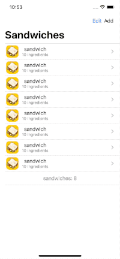

# Purpose 
This is copy demo referring [Introduction to SwiftUI - WWDC  ](https://developer.apple.com/videos/play/wwdc2020/10119/)

### using... 
Stack, List, NavigationView, tapGesture, image, label, text,  @State, @StateObject, Spacer, ... 
